<picture>
    <source media="(prefers-color-scheme: dark)" srcset="images/microchip_logo_white_red.png">
    <source media="(prefers-color-scheme: light)" srcset="images/microchip_logo_black_red.png">
    
</picture>

## MATLAB-Simulink Model for ACIM Control: Sensored FOC (Incremental Encoder), Sensorless FOC, and V/F Control: MCHV-230VAC-1.5kW Development Board and dsPIC33AK128MC106 Motor Control DIM

## 1. INTRODUCTION
This document describes the setup requirements for driving a 3-Phase AC Induction Motor (ACIM) on the hardware platform [EV78U65A](https://www.microchip.com/en-us/development-tool/ev78u65a) "MCHV-230VAC-1.5kW Development Board"  and [EV68M17A](https://www.microchip.com/en-us/development-tool/ev68m17a) "dsPIC33AK128MC106 Motor Control Dual In-line Module (DIM)".

The MATLAB/Simulink model supports:
- Sensored Field-Oriented Control (FOC) using an incremental encoder via the QEI module,
- Sensorless FOC utilizing a Back-EMF-based PLL estimator,
- Volts/Hertz (V/F) control algorithm.

Additionally, field weakening algorithm is implemented to enable extended speed operation beyond the nominal speed.

Enhance your embedded applications with Microchip's high-performance [dsPIC® Digital Signal Controllers (DSCs)](https://www.microchip.com/en-us/products/microcontrollers-and-microprocessors/dspic-dscs). Visit our [Motor Control and Drive page](https://www.microchip.com/en-us/solutions/technologies/motor-control-and-drive) to stay updated on the latest motor control solutions from Microchip.
 

## 2. SUGGESTED DEMONSTRATION REQUIREMENTS

### 2.1 MATLAB Model Required for the Demonstration

-  MATLAB model can be cloned or downloaded as zip file from the Github repository: [main page of this repository](https://github.com/microchip-pic-avr-solutions/matlab-mchv230vac1.5kw-33ak128mc106-acim-foc-vf).

### 2.2 Software Tools Used for Testing the MATLAB/Simulink Model

- MPLAB® X IDE and IPE **v6.25** 
- Device Family Pack (DFP): **dsPIC33AK-MC_DFP v1.4.172**
- MPLAB® XC-DSC Compiler **v3.31**
- MATLAB R2025b
- Required MATLAB add-on packages
    -	Simulink (v25.2)
    -	Simulink Coder (v25.2)
    -	Stateflow (v25.2)
    -	MATLAB Coder (v25.2)
    -	Embedded Coder (v25.2)
    -	MPLAB Device blocks for Simulink (v3.63.03)
    -   Motor Control Blockset (v25.2)

> **Note:**  
>The software used for testing the firmware prior to release is listed above. It is recommended to use these or later versions of the tool for building the firmware. All previous versions of Device Family Packs (DFP) and Tool Packs can be downloaded from [Microchip Packs Repository.](https://packs.download.microchip.com/)
### 2.3 Hardware Tools Required for the Demonstration
- MCHV-230VAC-1.5kW Development Board [(EV78U65A)](https://www.microchip.com/en-us/development-tool/ev78u65a)
- dsPIC33AK128MC106 Motor Control Dual In-line Module [(EV68M17A)](https://www.microchip.com/en-us/development-tool/ev68m17a)
- LEESON 3-Phase Induction Motor (230V, 60Hz, 1/3HP, 1.4A)
- Phoenix America [H9 Series](https://www.phoenixamerica.com/media/wysiwyg/pdf/Data_Sheet/H9-Data-Sheet-180523.pdf) Incremental Magnetic Encoder [(H9-0512-0500-05-A-Y-A-F-A-X)](https://www.digikey.in/en/products/detail/phoenix-america/H9-0512-0500-05-A-Y-A-F-A-X/11675462)

> **Note:**  
>  Items [EV78U65A](https://www.microchip.com/en-us/development-tool/ev78u65a), and [EV68M17A](https://www.microchip.com/en-us/development-tool/ev68m17a) are available to purchase directly from [microchip DIRECT](https://www.microchipdirect.com/)
 

## 3. HARDWARE SETUP
This section describes the hardware setup required for the demonstration.
Refer ["Motor Control High Voltage 230VAC-1.5kW Development Board User's Guide"](https://ww1.microchip.com/downloads/aemDocuments/documents/MCU16/ProductDocuments/UserGuides/Motor-Control-High-Voltage-230VAC-1.5kW-Dev-Board-Users-Guide-DS70005576.pdf), before operating the unit.
> **Note:**  
>In this document, hereinafter the MCHV-230VAC-1.5kW Development Board is referred as **development board**.

1. Motor currents are amplified on the MCHV-230VAC-1.5kW development board; it can also be amplified by the amplifiers internal to the dsPIC33AK128MC106 on the DIM. The firmware and DIM are configured to sample and convert internal amplifier outputs (**'internal op-amp configuration'**) by default to measure the motor currents needed to implement FOC. **Table-1** summarizes the resistors to be populated and removed to convert the DIM from **‘internal op-amp configuration’** to **‘external op-amp configuration’** or vice versa.

     

     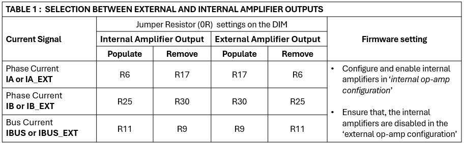

2. Ensure the development board is not powered and it is fully discharged. Verify the LEDs **LD1**(Green) and **LD4**(Red) on Power Factor Correction Board and **LD1**(Green) on Motor Control Inverter Board are not glowing.

     

     

3. Remove the thumb screw and open the top cover of the enclosure. Insert the **dsPIC33AK128MC106 Motor Control DIM** into the DIM Interface **connector J2** on the development board. Make sure the DIM is placed correctly and oriented before going ahead. Close the top cover of the enclosure and secure it with the thumb screw.

     

     

4. Connect the 3-phase wires from the motor to **A**, **B**, and **C** of the connector J13 - **MOTOR** on the development board, ensuring the connections are made in the correct sequence to achieve clockwise rotation of the motor.
    
    | Development Board|Leeson Motor (Nameplate) |
    |:-----------:|:------------:|
    | A | L1 |
    | B | L3 |
    | C | L2 |

     

      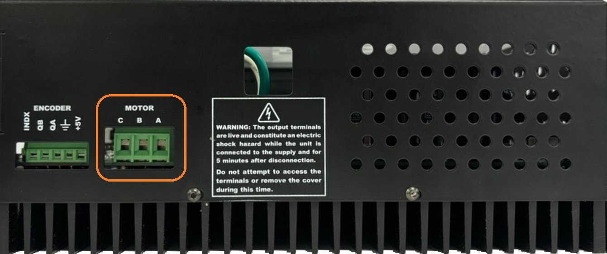

5. Interface the Encoder - [H9 Series Incremental Magnetic Encoder](https://www.phoenixamerica.com/media/wysiwyg/pdf/Data_Sheet/H9-Data-Sheet-180523.pdf)   (H9-0512-0500-05-A-Y-A-F-A-X) mounted on the motor to connector J7 - **ENCODER** provided on the Development Board as mentioned in the below table.

    |Development Board|Encoder wire color| Encoder signal|
    |:----:|:-------------:|:-------------:|
    |+5V|	Red|	Vcc|
    |DGND| Black| Gnd |
    |QA	| Yellow	|Ch A|
    |QB	| Blue |	Ch B |

     

      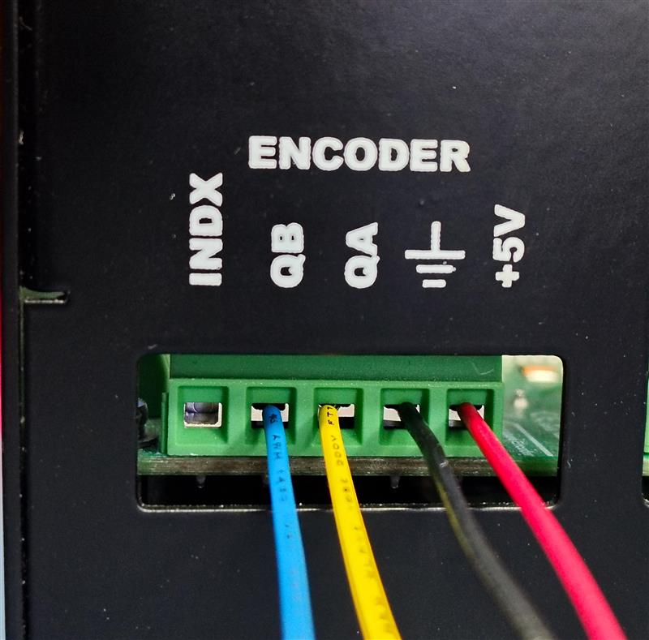

6. Power the development board from a controlled AC source by applying voltage of 220Vac rms through IEC connector **connector J1** provided on the PFC board.

     

      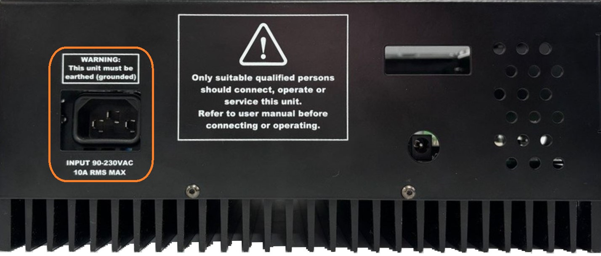

 
     > **Note:**  
     >The Development Board is designed to operate in the 90 to 230Vac rms voltage range with a maximum input current of 10Arms. In the Input AC voltage range of 90 to 150Vac rms, the maximum input power to the Development Board must be derated (<1500W) to maintain the input current through the socket to less than or equal to 10Arms.

 7. The development board has an isolated on-board programming tool called the Isolated PKoB4 Daughter Board. To use the isolated on-board programmer, connect a micro-USB cable between the Host PC and the connector J11(**PROGRAM**) on the development board.
      

     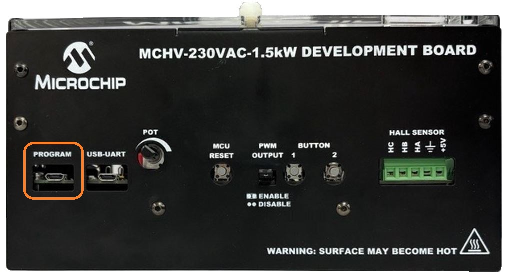

     > **Note:**  
     > Use only **shielded micro-USB** cables intended for data transfer.

 8. To establish serial communication with the host PC, connect a micro-USB cable between the host PC and the connector J8(**USB-UART**) on the development board. This interface provides an isolated USB-UART communication.
      

      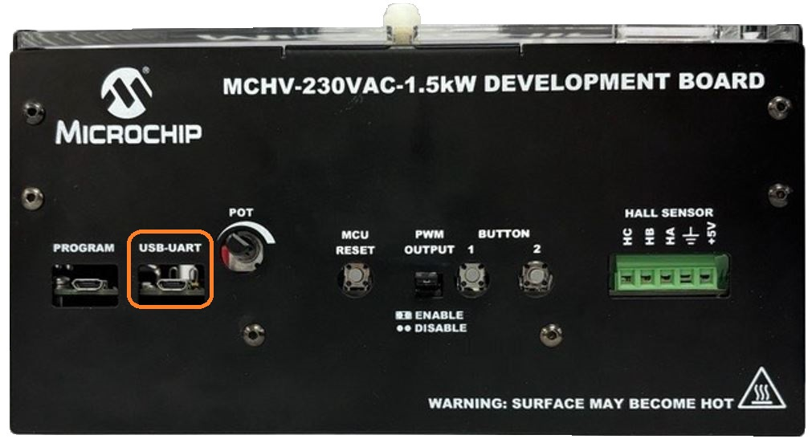

     > **Note:**  
     > Use only **shielded micro-USB** cables intended for data transfer.
  

## 4.  BASIC DEMONSTRATION

Follow the below instructions, step by step, to set up and run the motor control demo application:

1. Launch MATLAB (refer the section ["2.2 Software Tools Used for Testing the MATLAB/Simulink Model"](#22-software-tools-used-for-testing-the-matlabsimulink-model)). 
 
 
 2. Open the folder downloaded from the repository, in which MATLAB files are saved (refer the section ["2.1 MATLAB Model Required for the Demonstration"](#21-matlab-model-required-for-the-demonstration)).
     

     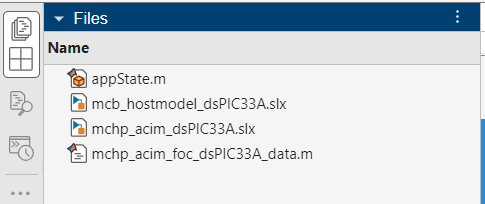

3.	
 Double click and open the MATLAB script file (<code>mchp_acim_foc_dsPIC33A_data.m</code>). This script file contains the configuration parameter for the motor and board. Run the file by clicking the <b>“Run”</b> icon and wait till all variables gets loaded on the <b>‘Workspace’</b> tab.
    
    

      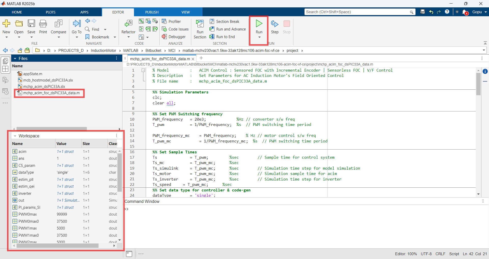

    

4.	Double click on the Simulink model - <b>mchp_acim_dsPIC33A.slx</b>.
    
    

      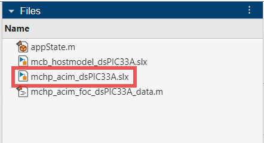

    

5.	
This opens the Simulink model as shown below. Click on the <b>"Run"</b> icon to start the simulation.
    
    

      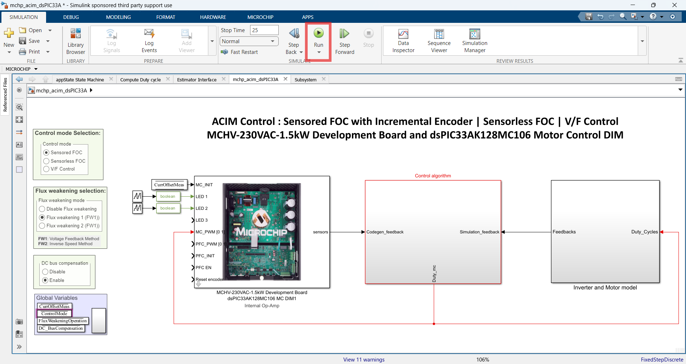

    

    By default, the Sensored Field-Oriented Control (FOC) operation mode is selected. Other operation modes can be selected using the radio button options:
    
    - Sensored FOC: Uses incremental encoder rotor speed feedback.
    - Sensorless FOC: Utilizes a Back-EMF-based PLL estimator for rotor position and speed estimation.
    - Volts/Hertz (V/F) Control: Implements a V/F control algorithm for open-loop motor operation.

    Flux Weakening Selection:
    - By default, Flux weakening 1(FW1) is selected, enabling flux weakening control through a PI controller that limits the operating voltage circle using voltage feedback.
    - Select Flux weakening 2(FW2) to enable flux weakening using the Inverse Speed Method (computes Id based on the inverse relation to the speed reference).
    - Select Disable Flux Weakening to turn off flux weakening control.

     

      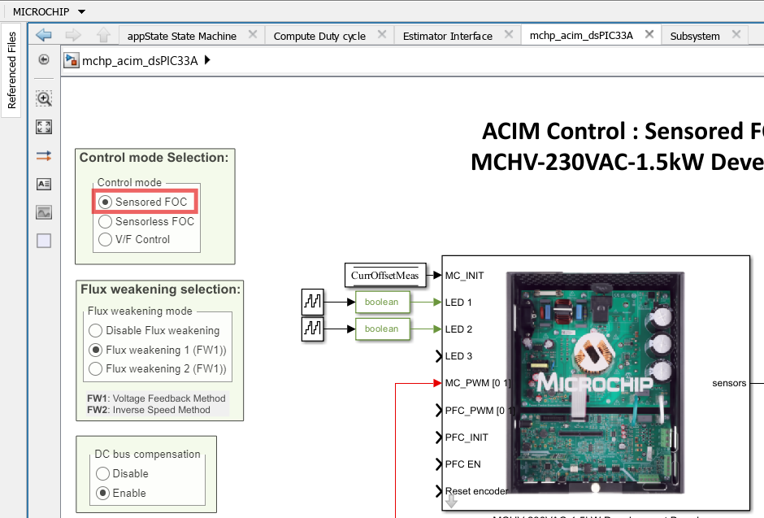

6.	
To plot the simulation result, <b>Data Inspector</b> is used (refer to figure below). To observe the additional signals, log them as required. Alternatively, normal Simulink Scope can be used to plot the signals.
    
    

      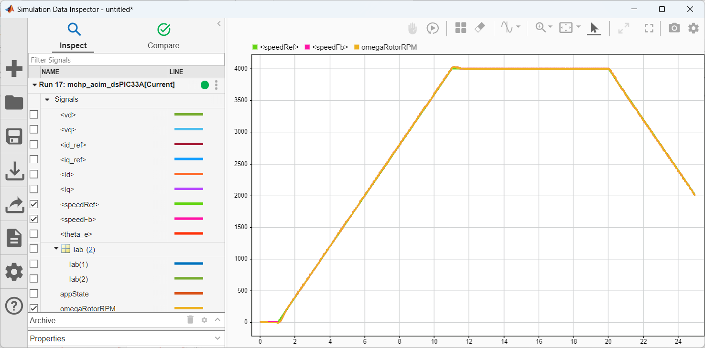

    

7.	
From this Simulink model an MPLAB X project can be generated, and it can be used to run the ACIM motor using development board. 
To generate the code from the Simulink model, go to the <b>"MICROCHIP"</b> tab, and enable the tabs shown in the figure below. 
    
    

      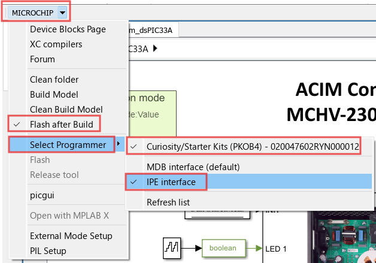

    

8.	
	To generate the code, click on <b>"Build" </b> option under the <b>“Microchip”</b> tab and <b>"Build, Deploy & Start" </b> drop down. This will generate the MPLAB X project from the Simulink model and program the dsPIC33AK128MC106 device.
    
    

      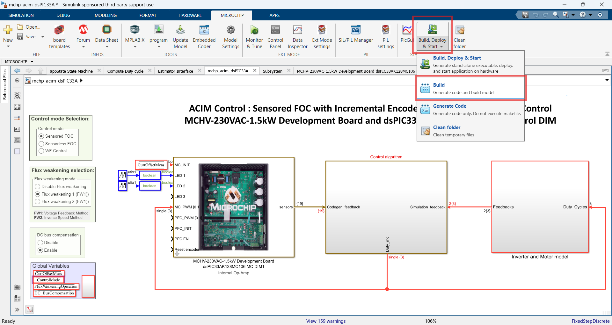

    

9. 
After completing the process, the <b>‘Operation Succeeded’</b> message will be displayed on the <b>‘Diagnostics Viewer’</b>.
    
    

      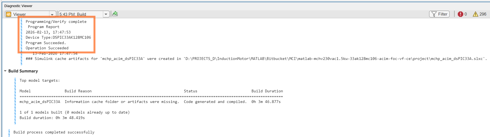

    

7. If the device is successfully programmed, **LED1 (D15)** and **LED2(D16)** will be **blinking**, indicating that the dsPIC® DSC is enabled.
    

     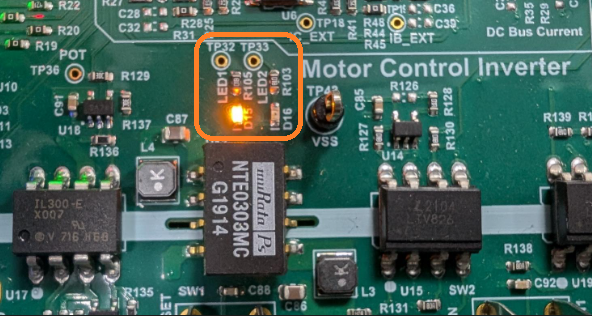

8. Run or stop the motor by pressing the push button **BUTTON 1**. Ensure the motor is spinning smoothly without any vibration in one direction. The specific motor was tested under no load conditions. To achieve optimal performance under loaded conditions, the control parameters in the firmware may need additional tuning.
     

     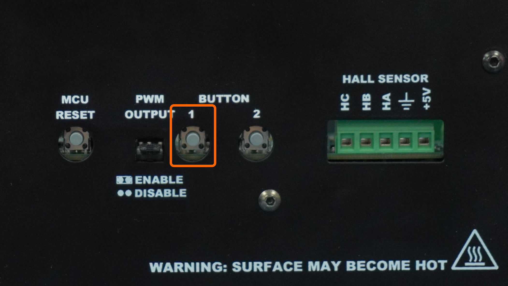

 
9. The motor speed can be varied using the potentiometer **(POT).**
    

    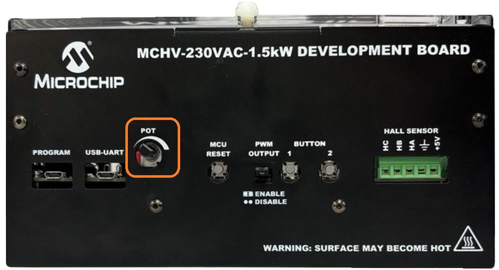

10. Press the push button **BUTTON 1** to stop the motor.

>**Note:** 
>The motor parameters and specifications are defined in the <code>mchp_acim_foc_dsPIC33A_data.m</code> files, based on the motor manufacturer's specifications. Exceeding these specifications may damage the motor, the board, or both. 

## 5. DATA VISUALIZATION USING MOTOR CONTROL BLOCKSET (MCB) HOST MODEL

The model comes with the initialization required for data visualization using Motor Control Blockset Host Model (MCB Host Model). The MCB Host Model is a Simulink model which facilitates data visualization through the UART Serial Interface.

1. 
To establish serial communication with the host PC, connect a micro-USB cable between the host PC and connector J16 on the development board. This interface is also used for programming.

2. 
Enter the COM port number of the USB connection in the MATLAB script file.
    

      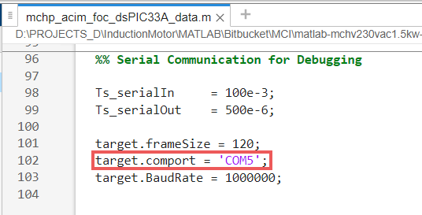

    

3. Ensure the ACIM control model is programmed and running as described under section ["4. Basic Demonstration"](#4-basic-demonstration) by following steps 1 through 13.

4. Open the **mcb_hostmodel_dsPIC33A.slx** model and click on the **Run** icon to plot the real time data.
    

      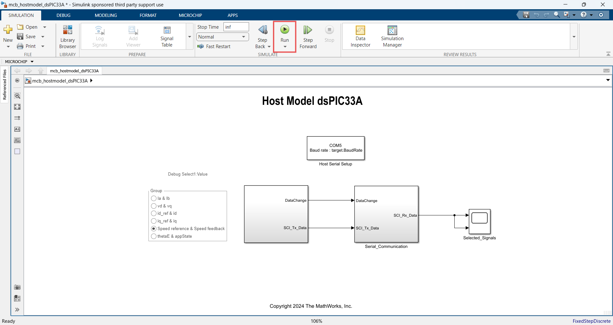

    

5. Select the signals on **Debug Select Value** pannel to plotted available signals on the scope.
    

      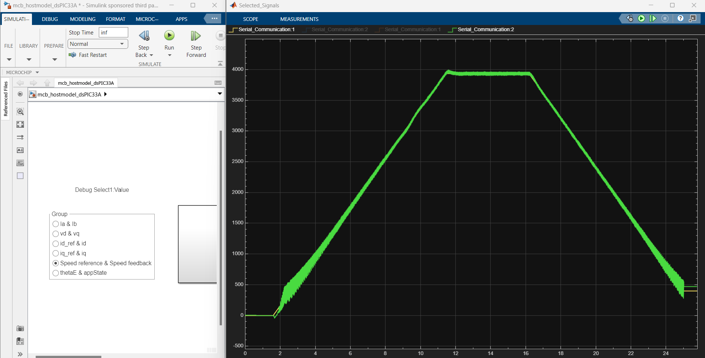

    

 
 ## 6. REFERENCES:
For additional information, refer following documents or links.
1. AN908 Application Note [ “ACIM Vector Control”](https://ww1.microchip.com/downloads/aemDocuments/documents/OTH/ApplicationNotes/ApplicationNotes/00908B.pdf)
2. Motor Control High Voltage 230VAC-1.5kW Development Board User’s Guide [(DS70005576)](https://ww1.microchip.com/downloads/aemDocuments/documents/MCU16/ProductDocuments/UserGuides/Motor-Control-High-Voltage-230VAC-1.5kW-Dev-Board-Users-Guide-DS70005576.pdf)
3. dsPIC33AK128MC106 Motor Control Dual In-Line Module (DIM) Information Sheet [(DS70005527)](https://ww1.microchip.com/downloads/aemDocuments/documents/MCU16/ProductDocuments/InformationSheet/dsPIC33AK128MC106-Motor-Control-Dual-In-Line-Module-DIM-Information-Sheet-DS70005527.pdf)
4. dsPIC33AK128MC106 Family datasheet [(DS70005539)](https://ww1.microchip.com/downloads/aemDocuments/documents/MCU16/ProductDocuments/DataSheets/dsPIC33AK128MC106-Family-Data-Sheet-DS70005539.pdf)
5. MPLAB® X IDE User’s Guide [(DS50002027)](https://ww1.microchip.com/downloads/en/DeviceDoc/50002027E.pdf) or [MPLAB® X IDE help](https://microchipdeveloper.com/xwiki/bin/view/software-tools/x/)
6. [MPLAB® X IDE installation](http://microchipdeveloper.com/mplabx:installation)
7. [MPLAB® XC-DSC Compiler installation](https://developerhelp.microchip.com/xwiki/bin/view/software-tools/xc-dsc/install/)
8.  [Motor Control Blockset](https://in.mathworks.com/help/mcb/)
9.  [MPLAB Device Blocks for Simulink :dsPIC, PIC32 and SAM mcu](https://in.mathworks.com/matlabcentral/fileexchange/71892-mplab-device-blocks-for-simulink-dspic-pic32-and-sam-mcu)

